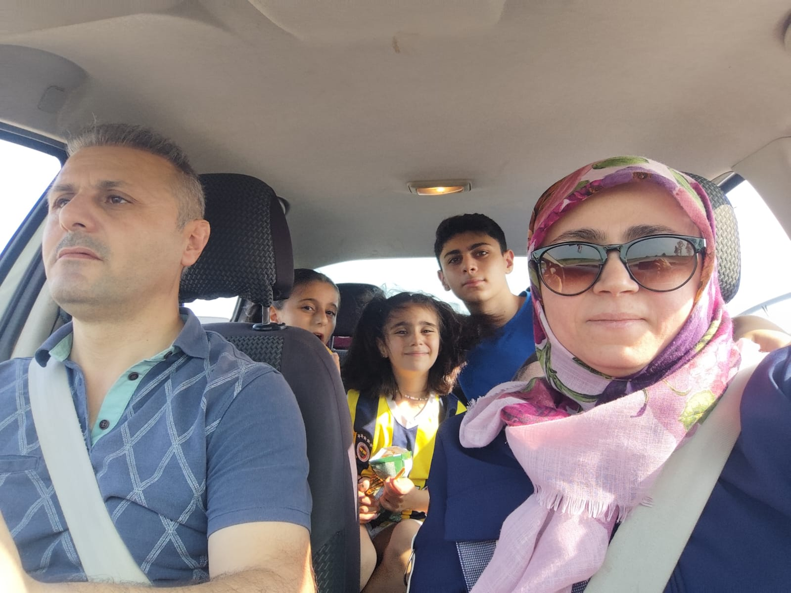
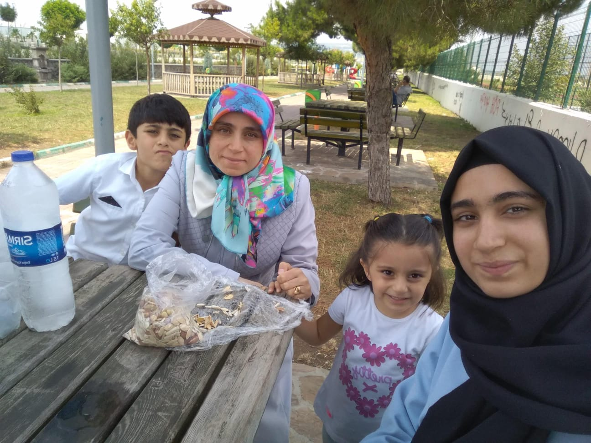

<!DOCTYPE html>
<html lang="tr">
<head>
  <meta charset="UTF-8">
  <title>Canım Teyzeme</title>
  
</head>
<body>
  <h1>Doğum Günün Kutlu Olsun Canım Teyzem! 🎂🎈</h1>
  
Senin gibi güzel kalpli bir insanı tanımak bir ayrıcalık. İyi ki varsın, iyi ki doğdun! ❤️

  <h2>Birlikte Geçirdiğimiz Güzel Anlar 📸</h2>
  
  

  <h2>Senin İçin Küçük Bir Video 🎥</h2>
  <iframe width="560" height="315" 
    src="https://www.youtube.com/embed/eLTjOI2le9w" 
    title="Teyzeme Özel Video" frameborder="0" 
    allow="accelerometer; autoplay; clipboard-write; encrypted-media; gyroscope; picture-in-picture" 
    allowfullscreen>
  </iframe>
</body>
</html>
